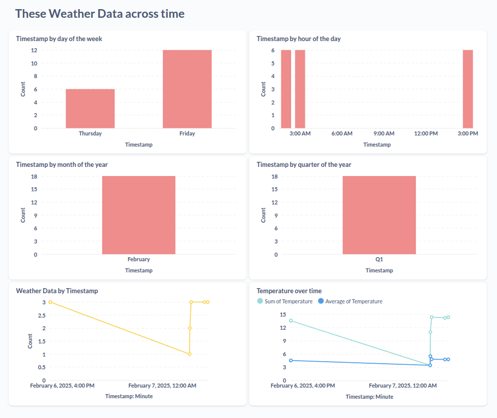
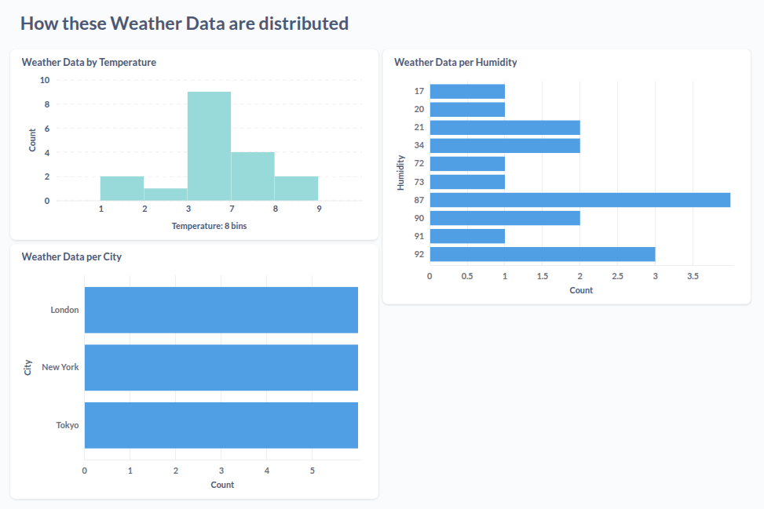

# Weather Data Pipeline

## Overview
This project is a weather data pipeline designed for data collection, processing, and analysis. It utilizes Docker for containerization, PostgreSQL for data storage, and Metabase for visualization.

## Project Structure
```
logs/                 # Directory for log files
plots/                # Directory for generated plots
images/               # Directory for project-related images and screenshots
.env                  # Environment variables
compose.yml           # Docker Compose configuration
database_setup.sql    # SQL script to set up the database
Dockerfile            # Docker configuration file
requirements.txt      # Python dependencies
weather_pipeline.py   # Main pipeline script
```

## Prerequisites
- Docker & Docker Compose
- Python 3.11+
- OpenWeatherMap API Key

## Setup Instructions

1. **Clone the Repository:**
   ```bash
   git clone git@github.com:cancinoray/weather-api-pipeline-dashboard.git
   cd weather-api-pipeline-dashboard
   ```

2. **Configure Environment Variables:**
   Create a `.env` file with the following content:
   ```env
   OPENWEATHER_API_KEY=your_openweather_api_key
   ```

3. **Build and Start Services:**
   ```bash
   docker compose up --force-recreate --build -d
   ```
   This will start:
   - **PostgreSQL Database** (with pre-configured schema)
   - **Weather Data Pipeline** (Python application)
   - **Metabase Dashboard** (accessible at `http://localhost:3000`)

## Running the Pipeline Manually
If needed, you can manually run the pipeline script:
```bash
docker compose exec weather_app python weather_pipeline.py
```

## Accessing Metabase Dashboard
Once services are up, visit [http://localhost:3000](http://localhost:3000) to explore data visualizations in Metabase. Follow the initial setup wizard (takes about 5 minutes)

### Configure Database Connection in Metabase
This will give us an access to our database
- Click on "Add your data"
- Select "PostgreSQL"
- Enter these details:
  ```
  Name: Weather Monitoring
  Host: postgres
  Port: 5432
  Database name: weather_monitoring
  Username: weather_user
  Password: weather_pass
  ```
- Click "Test Connection" to verify
- Click "Add database"


### Metabase Dashboard Screenshot

#### Weather Data Across Time


#### Weather Data Distribution


## Logs and Outputs
- Logs are stored in the `logs/` directory.
- Generated plots by data analysis are saved in the `plots/` directory.
- Project-related images are stored in the `images/` directory.

## Stopping Services
```bash
docker compose down
```

## Dependencies
All dependencies are listed in `requirements.txt`. To install them manually:
```bash
pip install -r requirements.txt
```

## License
This project is licensed under the MIT License.

---
Feel free to reach out for any issues or improvements!

